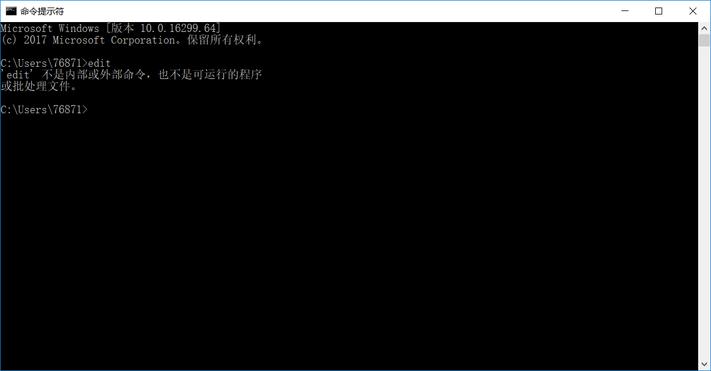

前段时间在玩dos命令行的时候，用copy con创建了txt文件后想对其进行编辑，然后我又不想用记事本，所以去网上找命令行中对文本文件进行编辑的命令（纯属想装B），结果看到了edit命令。

一敲，就出现了如下所示问题

<!--more-->

告诉我edit不是内部或外部命令，也不是可运行的程序。然后我就懵了，度娘骗我？

然后我告诉了我的室友，结果他试了一下edit命令发现可以。我，？？？。然后我再上网查，百度百科中对edit命令做了如下解释：

edit是DOS操作系统中的一个行编辑器程序，用于查看、编辑、创建计算机上的文本文件。该程序在Windows操作系统中也存在**（不含64位系统）**。

emmm，原因找到了，我的系统是64位的，所以不存在很正常。网上说可以把32位的edit.exe下载后放到C:\Windows\SysWOW64\下，我试了一下，呵呵。

此答案来自某知道。我觉得自己不知道的东西或者没有试验过的就不要随便乱讲，误人子弟。

后来找到一个echo命令，可以对文本内容进行覆盖或者追加，无法自由编辑。最后我还是老老实实的用了记事本。。。

如果你的系统是32位的还没有办法使用edit命令的话，嗯，倒是可以用某知道的方法解决,去下载一下32位的edit.exe,然后放到c盘下的system32的文件夹里面。

如果各位有更好的方法在dos下进行文本文件编辑可以留言告诉我！大家一起学习~