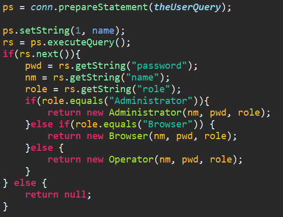
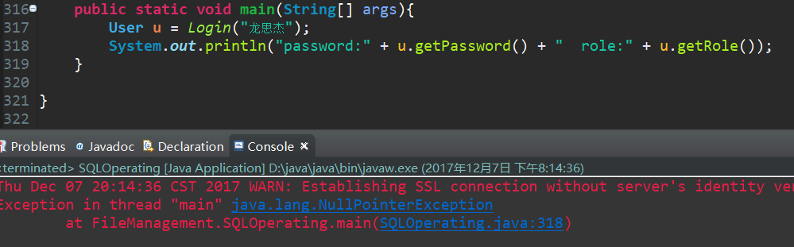
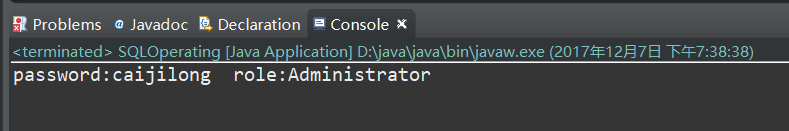
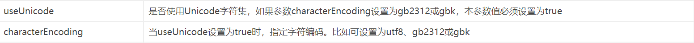

前段时间学习JDBC，要连接mysql获取数据。按照老师的样例数据，要存一些名字之类的信息，用的都是英文名，我当时就不太想用英文，就把我室友的名字存了进去，嘿嘿，结果，出问题了。

<!--more-->

连接数据库语句：

`static final String DB_URL = "jdbc:mysql://localhost/filemanagement";`

查询语句：

`private static final String theUserQuery = "SELECT name, password, role FROM userinfo WHERE name = ?";`

我是用我的名字做的查询，NullPointerException，很明显，没有用我的名字查到对应的数据，而数据库中是存在的。这是为什么呢？

百度到的答案是中文乱码导致的查询不到东西，解决方案是，修改连接数据库语句为：

`static final String DB_URL = "jdbc:mysql://localhost/filemanagement?useUnicode=true&characterEncoding=GBK";`

重试！

可以了！但这是为什么呢？那两个参数是什么？为什么加上之后就解决问题了？

这两个参数解释如下:

两个参数的缺省值都是false。也就是说我们在连接mysql的时候指定了连接使用的字符集后，一切就正常了。但我还是不太了解其中的机制，所以继续查。

原来Mysql连接进行查询等操作时存在一个字符集转换过程：

1.MySQL Server收到请求时将请求数据从character_set_client转换为character_set_connection；

2.进行内部操作前将请求数据从character_set_connection转换为内部操作字符集，其确定方法如下：

• 使用每个数据字段的CHARACTER SET设定值；

• 若上述值不存在，则使用对应数据表的DEFAULT CHARACTER SET设定值(MySQL扩展，非SQL标准)；

• 若上述值不存在，则使用对应数据库的DEFAULT CHARACTER SET设定值；

• 若上述值不存在，则使用character_set_server设定值。

3.将操作结果从内部操作字符集转换为character_set_results。

这些character set代表什么呢？

**character_set_server**：默认的内部操作字符集

**character_set_client**：客户端来源数据使用的字符集

**character_set_connection**：连接层字符集

**character_set_results**：查询结果字符集

**character_set_database**：当前选中数据库的默认字符集

**character_set_system**：系统元数据(字段名等)字符集

还查到了一些常见问题，虽然和我的问题不太一样，但很有参考意义。

• 向默认字符集为utf8的数据表插入utf8编码的数据前没有设置连接字符集，查询时设置连接字符集为utf8

– 插入时根据MySQL服务器的默认设置，character_set_client、character_set_connection和character_set_results均为latin1；

– 插入操作的数据将经过latin1=>latin1=>utf8的字符集转换过程，这一过程中每个插入的汉字都会从原始的3个字节变成6个字节保存；

– 查询时的结果将经过utf8=>utf8的字符集转换过程，将保存的6个字节原封不动返回，产生乱码……

• 向默认字符集为latin1的数据表插入utf8编码的数据前设置了连接字符集为utf8

– 插入时根据连接字符集设置，character_set_client、character_set_connection和character_set_results均为utf8；

– 插入数据将经过utf8=>utf8=>latin1的字符集转换，若原始数据中含有\u0000~\u00ff范围以外的Unicode字 符，会因为无法在latin1字符集中表示而被转换为“?”(0x3F)符号，以后查询时不管连接字符集设置如何都无法恢复其内容了。

（此部分摘自鸟哥的blog，稍后附上链接）

我数据库的表都是设置的utf8编码，但我第一次连接的时候没有设置连接字符集，所以默认为latin1，经过了从utf8=>latin1的转换，所以产生乱码。我第二次用的GBK编码，也没用utf8编码，为什么也可以了呢？其实是一个道理，中文不在latin1的编码中可是在GBK和utf8中，所以不会出问题。

到此为止所有的疑问都解开了，大家是否懂了呢？

附上参考博客链接：

<http://www.laruence.com/2008/01/05/12.html>

http://m.blog.csdn.net/zhliro/article/details/45464375